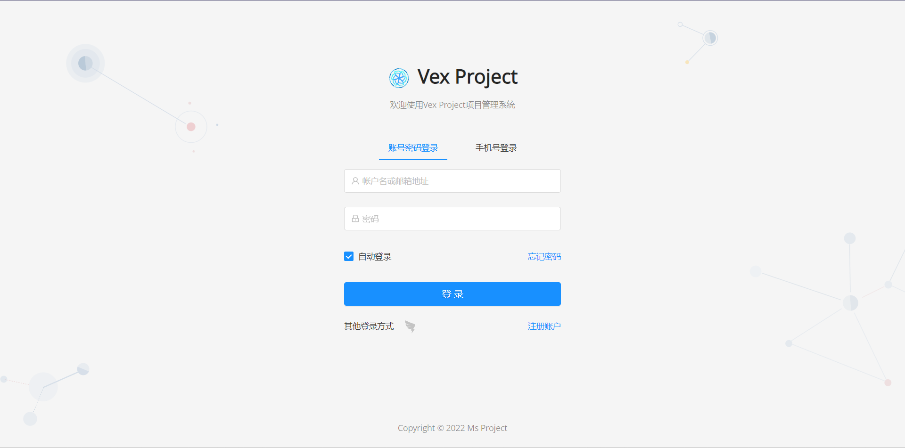

# vex项目协同管理系统
这是vex项目协同管理系统的前端，inspired by pear-project

## 界面展示



## 如何使用?

将代码pull到你的电脑上

```bash
git pull git@github.com:axzed/vex-project-frontend.git
```

拉取项目所需

```bash
npm install
```

运行

```bash
npm run serve
```

